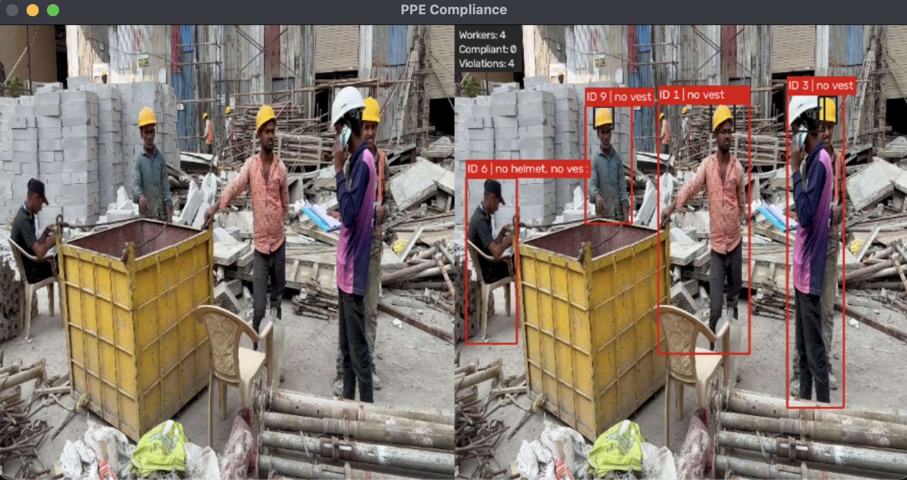

# PPE Compliance Monitor

A real-time Personal Protective Equipment (PPE) compliance monitoring system built using **YOLO11**, **ByteTrack**, and **OpenCV**. The system detects workers in video streams, tracks them across frames, and identifies missing safety equipment such as helmets and safety vests using temporal consistency checks.

---

## Features

- Real-time worker detection using a custom-trained YOLO11 model
- Multi-object tracking with ByteTrack
- Helmet and safety vest compliance monitoring
- Temporal smoothing to reduce false alerts
- Annotated video output with:
  - Worker IDs
  - Missing PPE labels
  - Compliance statistics
  - FPS monitoring
- Modular project structure for maintainability and future extension

---

## Demo



---

## System Pipeline

```
Video
   │
   ▼
YOLO11 Object Detection
   │
   ▼
ByteTrack Multi-Object Tracking
   │
   ▼
PPE Association
(Helmet ↔ Worker, Vest ↔ Worker)
   │
   ▼
Temporal Compliance Monitoring
   │
   ▼
Annotated Output Video
```

---

## Project Structure

```
ppe-compliance-monitor/
│
├── model/
│   └── best.pt                 # Trained YOLO11 weights
│
├── videos/
│   └── val3.mp4                # Sample input video
│
├── output/                     # Generated output videos
│
├── compliance.py               # PPE compliance logic
├── visualisation.py            # Drawing and HUD utilities
├── config.py                   # Project configuration
├── main.py                     # Main application pipeline
├── requirements.txt
└── README.md
```

---

## How It Works

1. A video is processed frame-by-frame.
2. YOLO11 detects workers, helmets, and safety vests.
3. ByteTrack assigns a persistent ID to each worker.
4. PPE detections are associated with workers using IoU.
5. Compliance history is maintained across multiple frames.
6. Workers are flagged only if missing PPE over a configurable time window, reducing false positives caused by missed detections.
7. The processed video is saved with annotations and compliance statistics.

---

## Technologies Used

- Python
- OpenCV
- Ultralytics YOLO11
- ByteTrack
- NumPy

---

## Installation

Clone the repository

```bash
git clone https://github.com/isabelmmathew/ppe-compliance-monitor.git
cd ppe-compliance-monitor
```

Create a virtual environment

```bash
python -m venv .venv
```

Activate it

### macOS / Linux

```bash
source .venv/bin/activate
```

### Windows

```bash
.venv\Scripts\activate
```

Install dependencies

```bash
pip install -r requirements.txt
```

---

## Running the Project

Update the paths in `config.py` if required.

Run

```bash
python main.py
```

The processed video will be saved to the output directory.

---

## Configuration

The following parameters can be modified in `config.py`:

- Detection confidence threshold
- Input video path
- Output video path
- Model path
- Frame size
- Temporal alert window
- Compliance threshold

---

## Future Improvements

- FastAPI backend for video upload and inference
- AWS EC2 deployment
- Amazon S3 integration for storing uploaded and processed videos
- Additional PPE classes (gloves, boots, goggles, harness)
- Live webcam and RTSP stream support
- Dashboard with compliance analytics

---
